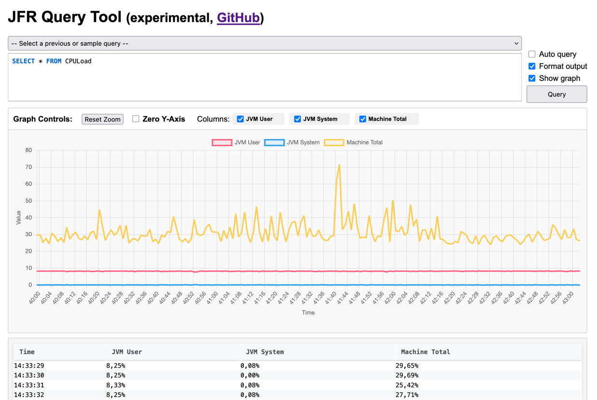

JFR Query Experiments
=====================

In this branch, I try to experiment with using DuckDB as the backend for JFR queries.

Usage:

```shell
java -jar target/query.jar duckdb import recording.jfr duckdb.db -e STACK_TRACES
```

Then you can use any DuckDB client to query the `duckdb.db` file.
For example, using the DuckDB CLI:

```shell
> duckdb duckdb.db
D SELECT * FROM CPULoad;
┌────────────────────────────┬──────────────┬───────────────┬──────────────┐
│         startTime          │   jvmUser    │   jvmSystem   │ machineTotal │
│         timestamp          │    float     │     float     │    float     │
├────────────────────────────┼──────────────┼───────────────┼──────────────┤
│ 2024-05-24 10:06:42.816701 │  0.012596757 │  0.0018829145 │   0.92435896 │
│ 2024-05-24 10:06:44.141573 │ 0.0058958004 │   0.002999063 │    0.9324324 │
...
```
Limitations:
- Durations are stores as nanoseconds.
- Stack traces are stored a fixed size (100 frames by default) but are slow to import, so avoid if possible.

Lessons learned on duckdb
-------------------------
- not using the appender is a terrible idea, it is much, much slower
  - so fixed arrays instead of varlen are a good idea

TODO
- simple "query" command that 
  - shows errors better
  - implement another table view that is closer to the original JFR view
  - investigate why allocation-by-class differs between jfr and duckdb
- generate description of all tables and views in a database, that contains the relationships (like class ids)
- performance comparison with Calcite based Gunnar Morling stuff and other tools (like jfr)

Features
- supports all JFR views (most of them are tested, of view.ini till 25. September)

Write basic blog post

Old
===

Experiments with `jfr` tool code and JFR queries.

It's essentially a standalone version of the `jfr view` command,
based, currently, on the [JDK 21](https://github.com/openjdk/jdk21u) code.

And it has a (highly experimental) web mode to easily test JFR queries:

```shell
java -jar target/query.jar web recording.jfr
-> starts a web server on port 8080
-> open http://localhost:8080
```



Build
-----

```shell
git clone https://github.com/parttimenerd/jfr-query-experiments
cd jfr-query-experiments
mvn clean package
```

Run
---
```shell
java -jar target/jfr-query-experiments.jar
-> shows the help
```

Purpose
-------
Play with JFR queries, maybe extend them, without having to build the whole JDK.

License
-------
GPL-2.0, Copyright 2017 - 2025 SAP SE or an SAP affiliate company and contributors.